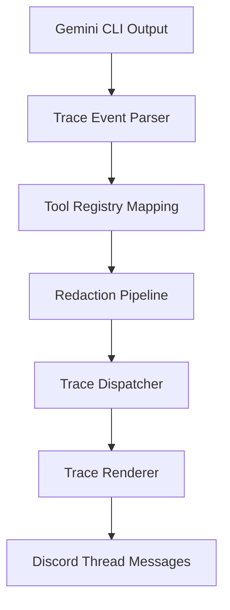

# Workflow Threads Architecture

Monitored workflow threads mirror the Gemini CLI's tool-call trace experience directly inside Discord. They are designed for developers and power users who want to inspect underlying execution traces, tool arguments, command flags, and console outputs under the hood.

## Thread Routing & Creation

1. **Opt-In Triggers**:
   - Slash Command: `/workflow <task>`
   - Text Command: `!thread <task>` or `!workflow <task>` (restricted to the Boss user).
   - API/Admin: `POST /workflow` and `discord_admin action:"workflow"`.
   - All entrypoints share task validation. Blank tasks and low-information single-token tasks such as `job` are rejected before any Discord thread is created.
   - After the thread manifest is saved, the initiating request is adapted into a thread-scoped turn and enqueued through the normal message processor. The trace renderer only runs from observed CLI/ACP events from that turn.
2. **DM Overflow**:
   - Direct Messages (DMs) cannot host native threads directly.
   - If a workflow thread is requested via a DM or a DM-based command, it overflows to a configured channel specified by `WORKFLOW_PARENT_CHANNEL_ID` in the server.
   - If `WORKFLOW_PARENT_CHANNEL_ID` is unset or points to an invalid/inaccessible channel, the request is rejected with a clear error message.
3. **Guild Channel Checks**:
   - The thread creator validates that the parent channel is a guild text channel, thread-capable, and allowed via routing rules.

## Session Isolation & Seed Context

1. **Session Scope Isolation**:
   - Each workflow thread runs in a completely isolated Gemini CLI session.
   - Session keys use the format `thread:{threadId}`.
   - Unlike standard channel bindings, workflow sessions do not pollute or read standard channel/DM conversation memory.
2. **Seed Context Feed**:
   - To make the thread useful, it is initialized with a *Seed Context*.
   - If a source message is provided (e.g., when a user promotes a message to a thread), the content of the source message is injected as the initial user prompt.
   - The first text or slash workflow request uses the same thread-scoped session keys as later messages in the workflow thread.

## Trace Event Pipeline

The trace pipeline intercepts Gemini CLI ACP execution updates and translates them into live Discord updates. Current Gemini CLI versions emit tool metadata on top-level ACP fields such as `toolCallId`, `title`, `status`, `kind`, `content`, `rawInput`, and `rawOutput`; older nested `toolCall` payloads remain supported for compatibility.

### 1. Tool Registry Mapping
- maps Gemini tool calls (e.g., file reads, CLI executions) to friendly, structured actions.

### 2. Redaction Pipeline
Before any trace output is sent to Discord, it passes through a multi-stage regex-based redactor (`redaction.ts`):
- **Secret Envs & Tokens**: Redacts environment variables like `DISCORD_BOT_TOKEN`, `DAEMON_API_TOKEN`, and Bearer tokens.
- **Absolute Paths**: Converts absolute system paths to relative paths or generic `/Users/username/...` to protect local system identity.
- **IP Addresses**: Filters IPv4 and IPv6 addresses.
- **Command Flags**: Strips auth or sensitive flags from executed terminal commands.

### 3. Rendering & Dispatcher
- **Console Layout**: Trace output uses a Gemini CLI-style rhythm inside Discord: prompt echo, phase line, one editable run header, compact tool rows, fenced output blocks, and a separate final assistant answer.
- **Density Selection**: Simple reads, searches, globs, and directory listings render as one-line rows. Shell output, diffs, logs, errors, MCP calls, edits, writes, web fetches, and meaningful results render as plain transcript messages with fenced blocks where useful. Long sanitized output is attached as a text file instead of pasted inline.
- **Discord Message Edits**: To stay within Discord rate limits, the `TraceDispatcher` keeps track of the run header and active tool messages and updates them in place as the workflow transitions from queued to running to complete or failed. Tool updates correlate on both top-level `toolCallId` and older nested `toolCall.id`, so started, progress, and completion events edit the same trace message.
- **Run Heartbeat**: After a workflow is enqueued, the run header immediately changes to running and periodically refreshes elapsed time. Until the first trace event arrives it explicitly says it is waiting for the first tool event.
- **Native Thinking State**: The bridge relies on Discord's native typing indicator for model thinking and does not emit separate "Thinking..." trace cards.
