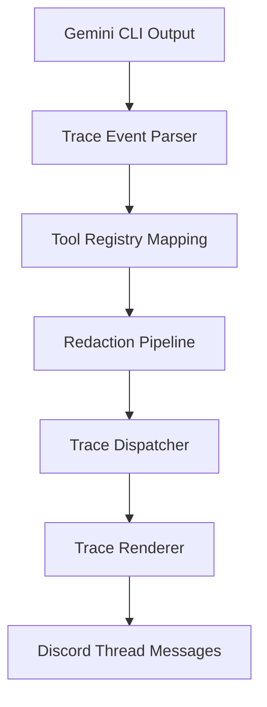

# Workflow Threads Architecture

Monitored workflow threads mirror the Gemini CLI's tool-call trace experience directly inside Discord. They are designed for developers and power users who want to inspect underlying execution traces, tool arguments, command flags, and console outputs under the hood.

## Thread Routing & Creation

1. **Opt-In Triggers**:
   - Slash Command: `/workflow <task>`
   - Text Command: `!thread <task>` or `!workflow <task>` (restricted to the Boss user).
2. **DM Overflow**:
   - Direct Messages (DMs) cannot host native threads directly.
   - If a workflow thread is requested via a DM or a DM-based command, it overflows to a configured channel specified by `WORKFLOW_PARENT_CHANNEL_ID` in the server.
   - If `WORKFLOW_PARENT_CHANNEL_ID` is unset or points to an invalid/inaccessible channel, the request is rejected with a clear error message.
3. **Guild Channel Checks**:
   - The thread creator validates that the parent channel is a guild text channel, thread-capable, and allowed via routing rules.

## Session Isolation & Seed Context

1. **Session Scope Isolation**:
   - Each workflow thread runs in a completely isolated Gemini CLI session.
   - Session keys use the format `thread:{threadId}`.
   - Unlike standard channel bindings, workflow sessions do not pollute or read standard channel/DM conversation memory.
2. **Seed Context Feed**:
   - To make the thread useful, it is initialized with a *Seed Context*.
   - If a source message is provided (e.g., when a user promotes a message to a thread), the content of the source message is injected as the initial user prompt.

## Trace Event Pipeline

The trace pipeline intercepts the Gemini CLI's execution logs and translates them into live Discord updates.

### 1. Tool Registry Mapping
- maps Gemini tool calls (e.g., file reads, CLI executions) to friendly, structured actions.

### 2. Redaction Pipeline
Before any trace output is sent to Discord, it passes through a multi-stage regex-based redactor (`redaction.ts`):
- **Secret Envs & Tokens**: Redacts environment variables like `DISCORD_BOT_TOKEN`, `DAEMON_API_TOKEN`, and Bearer tokens.
- **Absolute Paths**: Converts absolute system paths to relative paths or generic `/Users/username/...` to protect local system identity.
- **IP Addresses**: Filters IPv4 and IPv6 addresses.
- **Command Flags**: Strips auth or sensitive flags from executed terminal commands.

### 3. Rendering & Dispatcher
- **Compact Layout**: In v1, the trace output is compacted to fit nicely within Discord's message size limits (2000 chars) and avoid excessive scrolling.
- **Discord Message Edits**: To stay within Discord rate limits, the `TraceDispatcher` keeps track of the active tool message and updates it in place using `.edit()` as the tool executes (e.g., pending, updating progress, and completed status).
